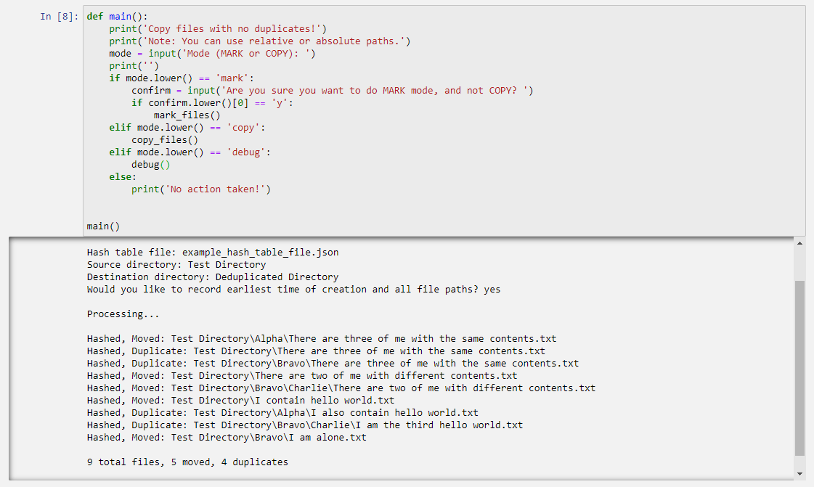

# The Deduplication Notebook

This is a Python [Jupyter Notebook](https://jupyter.org/install) that I use for deduplicating folders.

Personally, I do manual backups of my old computers, phones, and other data-storing devices and that leads to a lot of files being saved multiple times.  This notebook allows you to copy a directory to a new location, keeping only the oldest files while recording all file paths for archival purposes.

## Launching the Notebook

To install Jupyter Notebook, run:

```bash
pip install notebook
```

To launch Jupyter Notebook, run in this repo's directory:

```bash
jupyter notebook
```

## Using the Notebook

Once Jupyter notebook is open in your browser, navigate to the notebook and follow the relevant steps in the first cell.

In most cases, you'll want to follow the steps for **Deduplicating a Directory**.

Try it out with the test directory in this repo and take a look at the contents of the hash table file!


